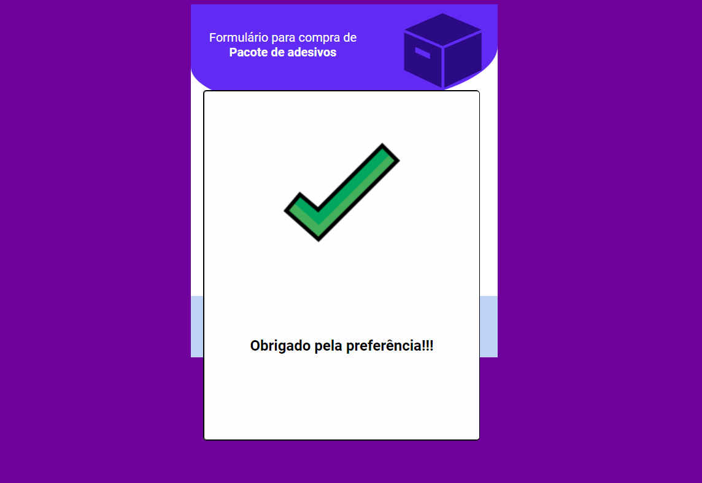

#Loja de Adesivos

 <table>
     <tr>
       <td align="center">
         
      </td>
       </tr>
    </table>

  <table> 
    <tr>
       <td align="center">
         
    </td>
    </tr>
  </table>

 <table>
    <tr>
     <td align="center">
        
     </td>
    </tr>
</table>

## 🚀 Tecnologias

Esse projeto foi desenvolvido com as seguintes tecnologias:

- HTML
- CSS
- Javascript

## 💻 Projeto

Loja de Adesivos foi um desafio para teste de conhecimento e habilidades!

##🤝 Colaboradores

<table>
  <tr>
    <td align="center">
      <a href="#">
         
        
          <b>Eudes Barbosa</b>
        
      </a>
    </td>
</tr>
</table>
 

[ ⬆ Voltar ao topo ](#LojadeAdesivos) 
